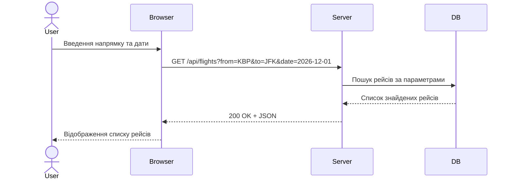

# Діаграма послідовності пошуку авіарейсів

```mermaid
sequenceDiagram
    actor User
    participant Browser
    participant Server
    participant DB

    User->>Browser: Введення напрямку та дати
    Browser->>Server: GET /api/flights?from=KBP&to=JFK&date=2026-12-01
    Server->>DB: Пошук рейсів за параметрами
    DB-->>Server: Список знайдених рейсів
    Server-->>Browser: 200 OK + JSON
    Browser-->>User: Відображення списку рейсів
```